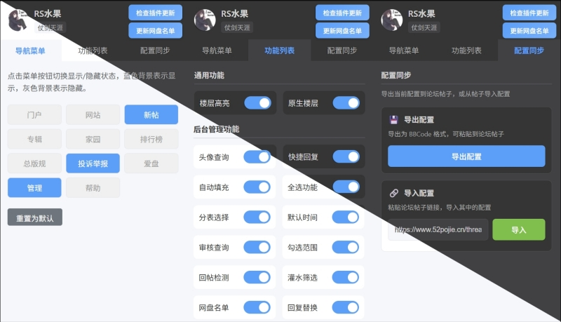

# 吾爱管理效率助手

一个专为吾爱破解论坛(52pojie.cn)设计的浏览器扩展，提供便捷的导航菜单管理功能，提升论坛管理效率。


## 功能特性

- **导航菜单管理**: 允许用户自定义显示/隐藏论坛顶部导航菜单
- **头像查询**: 鼠标移动到用户头像时，自动显示该用户的违规记录
- **深色主题支持**: 自动检测并适配系统主题（深色/浅色模式）
- **快捷回复**: 在举报处理页面添加快捷回复短语下拉框
- **楼层高亮**: 根据URL参数高亮指定楼层，提高管理效率
- **原生楼层显示**: 显示已结帖的原生楼层，方便管理悬赏贴
- **全选功能**: 在管理页面添加"除第一条全选"按钮，方便批量操作
- **分表选择器**: 将分表选择器替换为按钮式界面，提高操作效率
- **默认查询时间**: 将查询开始时间默认设置为2008-03-13，自动提交查询
- **管理页面查询**: 在管理页面鼠标移动到用户名链接时，自动显示该用户的违规记录
- **自动填充**: 智能监控多种表单，满足条件时自动填充回复内容
  - 评分表单（rateform）：根据评分自动填充
  - 处理表单（moderateform）：根据处理类型自动填充不同内容
  - 举报表单（reportform）：根据积分奖励自动填充
- **勾选范围**: 在管理页面上点击表格行（tr）来勾选对应的复选框，提高操作效率
- **重复回帖检测**: 在帖子详情页面检测当天内同一用户的多次回帖，高亮显示重复回帖的楼层
- **灌水筛选**: 在管理页面创建可拖动的过滤卡片，支持正则和简单匹配，高亮符合条件的行
- **版本更新检查**: 定期检查新版本，通过通知和设置页面横幅提醒用户更新
- **实时预览**: 点击按钮实时切换菜单显示/隐藏状态
- **用户信息缓存**: 在非 52pojie.cn 页面显示缓存的用户信息，避免显示"未登录 游客"字样
- **一键重置**: 支持恢复默认导航菜单配置
- **紧凑布局**: 优化了组件布局，描述文字移至悬停提示，减少页面滚动
- **样式统一管理**: 重构子组件样式管理，统一在父组件中管理，提高代码可维护性

## 安装与使用

### 开发模式

1. 安装依赖：

   ```bash
   pnpm install
   ```

2. 启动开发服务器：

   ```bash
   pnpm dev
   ```

3. 加载扩展：
   - 打开 Chrome 浏览器，访问 `chrome://extensions/`
   - 开启"开发者模式"
   - 点击"加载已解压的扩展程序"
   - 选择项目根目录下的 `dist/` 文件夹

### 生产构建

1. 构建生产版本：

   ```bash
   pnpm build
   ```

2. 打包扩展：
   ```bash
   pnpm zip
   ```

## 项目结构

```
52pjhelper/
├── src/
│   ├── features/                 # 功能模块目录（按功能聚合）
│   │   ├── contentFilter/        # 灌水筛选（8 个 TS + config + Toggle）
│   │   ├── autofills/            # 自动填充（5 个 TS + config + Toggle）
│   │   ├── userCloudDiskList/    # 用户网盘名单（9 个 TS + config + Toggle + UpdateButton）
│   │   ├── navigation/           # 导航菜单（navigationHider + config + Settings）
│   │   ├── versionCheck/         # 版本检查（versionChecker + config + Toggle）
│   │   ├── tableDataExtractor/   # 表格数据提取（utils + config）
│   │   ├── avatarQuery/          # 头像查询（utils + config + Toggle）
│   │   ├── floorHighlighter/     # 楼层高亮（utils + config + Toggle）
│   │   ├── nativeFloorDisplay/   # 原生楼层显示（utils + config + Toggle）
│   │   ├── quickReply/           # 快捷回复（utils + config + Toggle）
│   │   ├── selectAll/            # 全选（utils + config + Toggle）
│   │   ├── tableSelector/        # 分表选择器（utils + config + Toggle）
│   │   ├── defaultTime/          # 默认时间（utils + config + Toggle）
│   │   ├── userLinkQuery/        # 管理页面查询（utils + config + Toggle）
│   │   ├── rowClickToCheck/      # 勾选范围（utils + config + Toggle）
│   │   ├── duplicatePostDetection/    # 重复发帖检测（utils + config + Toggle）
│   │   └── duplicateReplyDetection/   # 重复回帖检测（utils + config + Toggle）
│   ├── components/               # 共享 UI 组件
│   │   ├── AdminFeaturesToggle.vue    # 后台管理功能组开关
│   │   ├── GeneralFeaturesToggle.vue  # 通用功能组开关
│   │   ├── Notification.vue           # 通知组件
│   │   ├── NotificationContainer.vue  # 通知容器
│   │   └── NotificationIcon.vue       # 通知图标
│   ├── composables/              # Vue 3 可组合函数
│   │   ├── useFeatureToggle.ts         # 功能切换可组合函数
│   │   ├── useFeatureToggleWithNotification.ts # 带通知的功能切换
│   │   └── useNotification.ts          # 通知系统可组合函数
│   ├── entries/                  # 入口文件目录（WXT 框架约束）
│   │   ├── contents/             # Content Script 入口
│   │   │   ├── index.ts          # 主入口（防重复初始化）
│   │   │   ├── initialization.ts # 功能初始化模块
│   │   │   ├── messageHandler.ts # 消息处理器
│   │   │   └── storageListener.ts # 存储监听器
│   │   ├── background/           # Background Script 入口
│   │   │   └── index.ts         # 后台脚本（版本检查）
│   │   └── popup/               # Popup 页面入口
│   │       ├── App.vue          # 根组件
│   │       ├── main.ts          # 入口文件
│   │       └── index.html       # HTML 模板（含全局 CSS 变量）
│   ├── pages/                    # 页面组件
│   │   └── SettingsPanel.vue    # 设置面板主组件
│   ├── styles/                   # 共享样式
│   │   ├── toggle.css           # Toggle 组件共享样式
│   │   ├── buttons.css          # 按钮共享样式
│   │   ├── common.css           # 通用样式
│   │   └── messages.css         # 消息样式
│   └── utils/                    # 共享工具函数
│       ├── storageHelper.ts     # 存储操作辅助（18+ 消费者）
│       ├── urlMatcher.ts        # URL 匹配工具（9 消费者）
│       ├── messageHelper.ts     # 消息通信辅助
│       ├── featureManager.ts    # 功能管理器基类
│       ├── userInfo.ts          # 用户信息获取
│       ├── userViolationFetcher.ts # 用户违规信息获取
│       └── themeManager.ts      # 主题管理
├── public/                       # 静态资源
│   └── images/                  # 扩展图标
├── Task/                         # 重构规划文件（开发辅助）
├── wxt.config.ts                 # WXT 框架配置（含路径别名）
├── tsconfig.json                 # TypeScript 配置
└── package.json                  # 项目依赖
```

## 路径别名

项目配置了以下路径别名以简化导入：

- `@` → `src/`
- `@com` → `src/components/`
- `@utils` → `src/utils/`
- `@ent` → `src/entries/`
- `@pages` → `src/pages/`
- `@features` → `src/features/`

## 技术栈

- **框架**: WXT ^0.20.13（现代化浏览器扩展开发框架）
- **语言**: TypeScript ^5.9.3
- **UI 框架**: Vue ^3.5.27
- **构建工具**: Vite（WXT 内置）
- **包管理器**: pnpm@10.28.0
- **代码格式化**: Prettier ^3.8.0
- **浏览器支持**: Chrome (Manifest V3)

## 架构特点

### 1. 可组合函数式架构（新增）

项目引入了 Vue 3 的可组合函数式架构，提供统一的功能开关逻辑：

- **`useFeatureToggle.ts`** - 功能切换可组合函数，封装了通用的功能开关逻辑
  - 提供统一的初始化、切换和状态管理
  - 内置防抖机制，防止重复点击
  - 统一的错误处理和用户反馈
  - 简化了组件代码，提高了可维护性

### 2. 功能管理器模式（新增）

- **`featureManager.ts`** - 功能管理器基类，提供统一的功能管理模式
  - 封装了功能启用/禁用、状态切换和初始化逻辑
  - 支持目标页面匹配和自动初始化
  - 提供一致的 API 接口，便于扩展和维护

### 3. 存储操作规范化（新增）

- **`storageHelper.ts`** - 存储操作辅助工具，提供统一的浏览器存储操作接口
  - 支持多种数据类型：布尔值、字符串、数组、对象
  - 内置错误处理和默认值支持
  - 提供批量操作和清空功能
  - 统一了存储操作的方式，减少重复代码

### 4. 消息通信规范化（新增）

- **`messageHelper.ts`** - 消息通信辅助工具，提供统一的浏览器消息通信接口
  - 封装了消息发送和响应处理
  - 支持功能切换的通用逻辑
  - 内置目标网站检查和错误处理
  - 统一了组件与 Content Script 的通信方式

### 5. URL 匹配工具（新增）

- **`urlMatcher.ts`** - URL 匹配工具，提供统一的 URL 匹配功能
  - 支持多种匹配模式：精确匹配、包含匹配、正则匹配、通配符匹配
  - 自动检测匹配模式，简化配置
  - 内置安全检查，防止正则表达式注入
  - 提供简化的目标页面匹配方法

### Content Script 模块化设计

项目采用模块化架构，将 Content Script 拆分为多个职责清晰的模块：

- **主入口** (`index.ts`) - 协调各模块，防止重复初始化
- **初始化模块** (`initialization.ts`) - 统一管理功能启动
- **消息处理器** (`messageHandler.ts`) - 处理来自 popup 的消息
- **存储监听器** (`storageListener.ts`) - 监听存储变化，实现跨页面同步

**优势**：

- 代码结构清晰，易于维护和扩展
- 符合 WXT 框架的最佳实践
- 模块职责单一，便于单元测试
- 减少代码重复，提高复用性

### 组件化设计

#### 功能分组

项目将功能开关按用途分为两组：

1. **通用功能组** (`GeneralFeaturesToggle.vue`)
   - 头像查询
   - 楼层高亮
   - 原生楼层显示

2. **后台管理功能组** (`AdminFeaturesToggle.vue`)
   - 快捷回复
   - 自动填充
   - 全选功能
   - 分表选择器
   - 默认查询时间
   - 管理页面查询
   - 勾选范围
   - 重复回帖检测
   - 灌水筛选

**优势**：

- 功能分类清晰，易于查找和管理
- 减少主组件代码量（从 536 行减少到 349 行）
- 提高代码可维护性和可扩展性

#### 样式管理

项目采用组件自管理样式的方式：

- **全局 CSS 变量**：定义在 `src/entries/popup/index.html` 中
- **共享样式**：Toggle 组件样式统一在 `src/styles/toggle.css` 中
- **组件样式**：每个组件管理自己的样式，使用 `scoped` 避免污染

**优势**：

- 避免样式冲突
- 易于维护和修改
- 符合组件化原则
- 减少代码重复

## 使用说明

### 导航菜单管理

1. 点击浏览器工具栏中的扩展图标
2. 在"导航菜单设置"选项卡中，点击菜单按钮可切换其显示/隐藏状态
3. 蓝色背景表示菜单当前可见，灰色背景表示菜单当前隐藏
4. 点击"重置为默认"按钮可恢复所有菜单的显示状态

### 头像查询

1. 在"更多设置"选项卡中，启用"头像查询"开关
2. 访问吾爱破解论坛，将鼠标移动到用户头像上
3. 自动显示该用户的违规记录（如有）

### 全选功能

1. 在"更多设置"选项卡中，启用"全选功能"开关
2. 访问管理页面（forum.php?mod=modcp&action=thread&op=post）
3. 页面会添加"除第一条 全选"按钮和"删除"按钮
4. 点击"除第一条 全选"按钮可以快速选择除第一条外的所有项目
5. 点击"删除"按钮可以执行删除操作

### 分表选择器

1. 在"更多设置"选项卡中，启用"分表选择"开关
2. 访问管理页面（forum.php?mod=modcp&action=thread&op=post）
3. 原始的分表选择器会被替换为按钮式界面
4. 按钮布局优化为蛇形排列，提高操作效率
5. 支持隐藏特定分表，简化界面

### 默认查询时间

1. 在"更多设置"选项卡中，启用"默认时间"开关
2. 访问管理页面（forum.php?mod=modcp&action=thread&op=post）
3. 查询开始时间会自动设置为2008-03-13
4. 页面会自动提交查询，确保时间切换生效

### 管理页面查询

1. 在"更多设置"选项卡中，启用"管理页面查询"开关
2. 访问管理页面（forum.php?mod=modcp&action=moderate&op=threads）
3. 将鼠标移动到用户名链接上
4. 自动显示该用户的违规记录（如有）

### 自动填充

1. 在"更多设置"选项卡中，启用"自动填充"开关
2. 功能会自动监控以下表单并智能填充：

**评分表单（rateform）**

- 当 `score2`（威望）输入框的值大于 0 时
- 或 `score6`（热心值）输入框的值等于 1 时
- 自动在 `reason` 输入框填入："已经处理，感谢您对吾爱破解论坛的支持！"

**处理表单（moderateform）**

- 当选择"已答复"时，自动填入："欢迎分析讨论交流，吾爱破解论坛有你更精彩！"
- 当选择"已处理"时，自动填入："已经处理，感谢您对吾爱破解论坛的支持！"

**举报表单（reportform）**

- 当任一积分奖励下拉框选择正数值（如 +1, +2, +5 等）时
- 自动在对应的消息输入框填入："已经处理，感谢您对吾爱破解论坛的支持！"

### 勾选范围

1. 在"更多设置"选项卡中，启用"勾选范围"开关
2. 访问管理页面或回收站页面
3. 点击表格行（tr）即可勾选对应的复选框
4. 点击行内的超链接或按钮不会触发复选框勾选

### 重复回帖检测

1. 在"更多设置"选项卡中，启用"重复回帖检测"开关
2. 访问帖子详情页面（如 https://www.52pojie.cn/thread-*-*.html）
3. 功能会自动检测当天内同一用户的多次回帖
4. 重复回帖的楼层会以黄色高亮显示，楼层号变为红色加粗

**配置说明**：

- 目标页面配置在 `src/configs/duplicateReplyDetection.json` 文件中
- 默认对所有帖子详情页面生效
- 功能默认启用

### 灌水筛选

1. 在"更多设置"选项卡中，启用"灌水筛选"开关
2. 访问管理页面（forum.php?mod=modcp&action=thread&op=post）
3. 页面会显示一个可拖动的过滤卡片
4. 在卡片中输入过滤条件（支持正则表达式和简单文本匹配）
5. 点击"简单/正则"按钮切换匹配模式
6. 点击"+ 添加条件"按钮添加更多过滤条件
7. 当卡片失去焦点时，自动执行过滤匹配
8. 匹配成功的行会以黄色高亮显示，并自动勾选对应的复选框

**功能特点**：

- 支持预设规则（常见灌水、标点数字灌水等）
- 可设置最大匹配文本长度（默认12个汉字）
- 卡片位置和过滤规则自动保存
- 支持动态添加/删除过滤条件

### 主题切换

- 扩展会自动检测并适配系统主题
- 当系统切换深色/浅色模式时，扩展界面会自动跟随变化

### 版本更新检查

1. 扩展会在后台定期检查是否有新版本发布（默认每 24 小时）
2. 发现新版本时，会通过浏览器通知提醒用户
3. 在设置页面顶部也会显示更新提示横幅
4. 点击"立即更新"按钮可打开更新帖子
5. 点击"忽略"按钮可关闭当前版本的提示
6. 检查间隔和目标帖子可在 `src/configs/versionCheck.json` 中配置

## 许可证

项目采用 AGPL-3.0-only 许可证。
